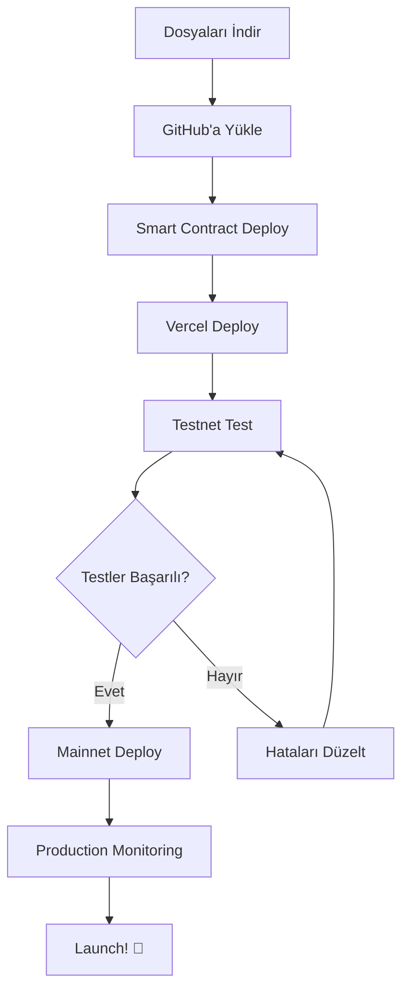

# 🚀 WIN WIN ETH RAFFLE - GITHUB ve DEPLOYMENT REHBERİ

## 📋 İÇİNDEKİLER
1. [Dosyaları İndirme ve Hazırlık](#1-dosyaları-indirme-ve-hazırlık)
2. [GitHub'a Yükleme](#2-githuba-yükleme)
3. [Smart Contract Deployment](#3-smart-contract-deployment)
4. [Vercel Deployment](#4-vercel-deployment)
5. [Test Aşamaları](#5-test-aşamaları)
6. [Sorun Giderme](#6-sorun-giderme)
7. [Production'a Geçiş](#7-productiona-geçiş)

---

## 1. DOSYALARI İNDİRME ve HAZIRLIK

### Adım 1.1: Projeyi İndirin
```bash
# Tüm dosyaları bilgisayarınıza indirin
# Not: Modu UI'dan "Download as ZIP" veya dosyaları tek tek indirin
```

### Adım 1.2: Klasör Yapısını Kontrol Edin
```
win-win-raffle/
├── src/
│   ├── app/
│   │   ├── api/
│   │   │   ├── buy/route.ts
│   │   │   └── admin/route.ts
│   │   ├── layout.tsx
│   │   ├── page.tsx
│   │   └── globals.css
│   ├── components/
│   ├── hooks/
│   └── lib/
├── contracts/
│   └── WinWinRaffle.sol
├── package.json
├── .env.example
├── next.config.mjs
├── tsconfig.json
└── tailwind.config.ts
```

### Adım 1.3: .env Dosyası Oluşturun
```bash
# .env.example dosyasını kopyalayın
cp .env.example .env.local

# .env.local dosyasını düzenleyin (ŞİMDİLİK BOŞ BIRAKIN, SONRA DOLDURACAĞIZ)
```

---

## 2. GITHUB'A YÜKLEME

### Adım 2.1: Git Kurulumu (İlk Kez Kullanıyorsanız)
```bash
# Git yüklü mü kontrol edin
git --version

# Yoksa indirin: https://git-scm.com/downloads

# Git yapılandırması
git config --global user.name "Adınız Soyadınız"
git config --global user.email "email@example.com"
```

### Adım 2.2: GitHub Repository Oluşturma

1. **GitHub'da:**
   - https://github.com adresine gidin
   - Sağ üstteki "+" butonuna tıklayın
   - "New repository" seçin
   - Repository adı: `win-win-eth-raffle`
   - Description: "Decentralized ETH raffle on BASE network"
   - **Public** veya **Private** seçin
   - ❌ "Add README" seçmeyin (zaten var)
   - ❌ ".gitignore" eklemeyin (zaten var)
   - "Create repository" tıklayın

### Adım 2.3: Yerel Projeyi Git'e Bağlama
```bash
# Proje klasörüne gidin
cd win-win-eth-raffle

# Git başlatın
git init

# Tüm dosyaları ekleyin
git add .

# İlk commit
git commit -m "Initial commit: WIN WIN ETH Raffle v1.0"

# GitHub repository'nize bağlayın (YOUR_USERNAME değiştirin)
git remote add origin https://github.com/YOUR_USERNAME/win-win-eth-raffle.git

# Ana branch'i main olarak ayarlayın
git branch -M main

# GitHub'a yükleyin
git push -u origin main
```

### Adım 2.4: Yükleme Doğrulaması
- GitHub repository sayfanızı yenileyin
- Tüm dosyaların yüklendiğini kontrol edin
- README.md'nin görüntülendiğini doğrulayın

---

## 3. SMART CONTRACT DEPLOYMENT

### Adım 3.1: Hardhat Kurulumu
```bash
# Proje klasöründe
npm install --save-dev hardhat @nomicfoundation/hardhat-toolbox

# Hardhat başlatın
npx hardhat init
# Seçenekler:
# ✔ Create a JavaScript project
# ✔ .gitignore eklensin mi? Yes
# ✔ dependencies yüklensin mi? Yes
```

### Adım 3.2: Hardhat Yapılandırması
`hardhat.config.js` dosyasını oluşturun/düzenleyin:

```javascript
require("@nomicfoundation/hardhat-toolbox");
require('dotenv').config();

module.exports = {
  solidity: {
    version: "0.8.20",
    settings: {
      optimizer: {
        enabled: true,
        runs: 200
      }
    }
  },
  networks: {
    // BASE Sepolia Testnet
    baseSepolia: {
      url: process.env.BASE_SEPOLIA_RPC_URL || "https://sepolia.base.org",
      accounts: process.env.PRIVATE_KEY ? [process.env.PRIVATE_KEY] : [],
      chainId: 84532
    },
    // BASE Mainnet
    base: {
      url: process.env.BASE_MAINNET_RPC_URL || "https://mainnet.base.org",
      accounts: process.env.PRIVATE_KEY ? [process.env.PRIVATE_KEY] : [],
      chainId: 8453
    }
  },
  etherscan: {
    apiKey: {
      baseSepolia: process.env.BASESCAN_API_KEY || "",
      base: process.env.BASESCAN_API_KEY || ""
    }
  }
};
```

### Adım 3.3: Cüzdan Hazırlığı
```bash
# MetaMask'ten Private Key alın:
# 1. MetaMask'i açın
# 2. Hesap detaylarına tıklayın
# 3. "Export Private Key" seçin
# 4. Şifrenizi girin
# 5. Private Key'i kopyalayın

# ⚠️ UYARI: Private Key'inizi ASLA paylaşmayın!
# ⚠️ Test için AYRI BİR CÜZDAN kullanın!
```

### Adım 3.4: .env.local Dosyasını Güncelleyin
```bash
# BASE Sepolia Testnet için
PRIVATE_KEY=your_private_key_here
BASE_SEPOLIA_RPC_URL=https://sepolia.base.org
BASESCAN_API_KEY=your_basescan_api_key

# Contract adresi (deployment sonrası eklenecek)
NEXT_PUBLIC_CONTRACT_ADDRESS=
```

### Adım 3.5: Test ETH Alın
```bash
# BASE Sepolia Testnet Faucet
1. https://www.coinbase.com/faucets/base-ethereum-goerli-faucet adresine gidin
2. Cüzdan adresinizi girin
3. "Send me ETH" tıklayın
4. Birkaç dakika bekleyin

# Alternatif Faucets:
- https://faucet.quicknode.com/base/sepolia
- https://learnweb3.io/faucets/base_sepolia
```

### Adım 3.6: Deploy Script Oluşturun
`scripts/deploy.js` dosyası oluşturun:

```javascript
const hre = require("hardhat");

async function main() {
  console.log("🚀 WinWinRaffle deployment başlıyor...");

  // Contract'ı deploy et
  const WinWinRaffle = await hre.ethers.getContractFactory("WinWinRaffle");
  const raffle = await WinWinRaffle.deploy();

  await raffle.waitForDeployment();
  const address = await raffle.getAddress();

  console.log("✅ WinWinRaffle deployed to:", address);
  console.log("📋 .env.local dosyanıza ekleyin:");
  console.log(`NEXT_PUBLIC_CONTRACT_ADDRESS=${address}`);
  console.log("\n🔗 Basescan verification:");
  console.log(`npx hardhat verify --network baseSepolia ${address}`);
}

main()
  .then(() => process.exit(0))
  .catch((error) => {
    console.error(error);
    process.exit(1);
  });
```

### Adım 3.7: Contract'ı Deploy Edin
```bash
# Contracts klasörüne WinWinRaffle.sol'u taşıyın
mkdir -p contracts
mv WinWinRaffle.sol contracts/

# Compile edin
npx hardhat compile

# BASE Sepolia'ya deploy edin
npx hardhat run scripts/deploy.js --network baseSepolia

# Çıktıyı not edin:
# ✅ WinWinRaffle deployed to: 0x...
```

### Adım 3.8: Contract'ı Verify Edin (Opsiyonel ama Önerilen)
```bash
# Basescan API key alın: https://basescan.org/apis

npx hardhat verify --network baseSepolia YOUR_CONTRACT_ADDRESS

# Başarılı olursa Basescan'de contract kodunuz görünür olacak
```

### Adım 3.9: .env.local'i Güncelleyin
```bash
# Contract adresini ekleyin
NEXT_PUBLIC_CONTRACT_ADDRESS=0xYourContractAddressHere
```

---

## 4. VERCEL DEPLOYMENT

### Adım 4.1: Vercel Hesabı Oluşturun
1. https://vercel.com adresine gidin
2. "Sign Up" tıklayın
3. GitHub ile giriş yapın
4. Yetkilendirme yapın

### Adım 4.2: Projeyi Import Edin
1. Vercel Dashboard'da "Add New..." → "Project"
2. GitHub repository'nizi seçin: `win-win-eth-raffle`
3. "Import" tıklayın

### Adım 4.3: Build Ayarları
```
Framework Preset: Next.js
Build Command: npm run build
Output Directory: .next
Install Command: npm install
```

### Adım 4.4: Environment Variables Ekleyin
Vercel'de "Environment Variables" bölümüne gidin ve ekleyin:

```bash
NEXT_PUBLIC_CONTRACT_ADDRESS=0xYourContractAddress
NEXT_PUBLIC_CHAIN_ID=84532
NEXT_PUBLIC_RPC_URL=https://sepolia.base.org

# Admin private key (sadece admin işlemleri için)
ADMIN_PRIVATE_KEY=your_admin_private_key
```

### Adım 4.5: Deploy Edin
```bash
# "Deploy" butonuna tıklayın
# 2-3 dakika bekleyin
# Deployment tamamlandığında URL alacaksınız
```

### Adım 4.6: Domain Ayarları (Opsiyonel)
```bash
# Vercel otomatik bir domain verir:
# win-win-eth-raffle.vercel.app

# Özel domain eklemek için:
# 1. Settings → Domains
# 2. "Add" tıklayın
# 3. Domain'inizi girin
# 4. DNS ayarlarını yapın
```

---

## 5. TEST AŞAMALARI

### Adım 5.1: Temel Fonksiyon Testleri

#### Test 1: Cüzdan Bağlantısı
- [ ] MetaMask yüklü mü kontrol edin
- [ ] "Connect Wallet" butonuna tıklayın
- [ ] MetaMask popup'ı geldi mi?
- [ ] Cüzdan adresi görünüyor mu?
- [ ] Network BASE Sepolia'ya geçti mi?

#### Test 2: Bilet Satın Alma
```bash
✅ Test Checklist:
- [ ] Bilet sayısını artırın (1-10 arası)
- [ ] Toplam fiyat doğru hesaplanıyor mu?
- [ ] "Buy Tickets" butonuna tıklayın
- [ ] MetaMask onay popup'ı geldi mi?
- [ ] Transaction fee görünüyor mu?
- [ ] "Confirm" tıklayın
- [ ] Transaction başarılı mı?
- [ ] Bilet sayınız güncellendi mi?
- [ ] "Your Tickets" bölümünde görünüyor mu?
```

#### Test 3: Sayfa Yenileme Persistence
```bash
✅ Test Checklist:
- [ ] Bilet satın alın
- [ ] Bilet sayısını not edin
- [ ] Sayfayı yenileyin (F5)
- [ ] Bilet sayısı aynı mı?
- [ ] Round ID değişmedi mi?
```

#### Test 4: Leaderboard Güncelleme
```bash
✅ Test Checklist:
- [ ] Leaderboard görünüyor mu?
- [ ] Bilet satın alınca leaderboard güncelleniyor mu?
- [ ] En çok bilet alanlar doğru sırada mı?
- [ ] Real-time güncelleniyor mu?
```

#### Test 5: Round Countdown
```bash
✅ Test Checklist:
- [ ] Countdown çalışıyor mu?
- [ ] Süre doğru gösteriliyor mu? (format: HH:MM:SS)
- [ ] Her saniye güncelleniyor mu?
- [ ] Round bittiğinde ne oluyor?
```

### Adım 5.2: Admin Panel Testleri

#### Test 6: Admin Authentication
```bash
# Admin cüzdan adresini contract'ta ayarlayın
# Hardhat console kullanarak:

npx hardhat console --network baseSepolia

const WinWinRaffle = await ethers.getContractFactory("WinWinRaffle");
const raffle = await WinWinRaffle.attach("YOUR_CONTRACT_ADDRESS");

# Admin kontrolü
await raffle.owner();

✅ Test Checklist:
- [ ] Admin cüzdanı ile bağlanın
- [ ] "Admin Panel" görünüyor mu?
- [ ] Diğer cüzdanlarla admin panel görünmüyor mu?
```

#### Test 7: Round Yönetimi
```bash
✅ Test Checklist:
- [ ] "Start New Round" butonu çalışıyor mu?
- [ ] Round duration ayarlanabiliyor mu?
- [ ] "End Round" butonu çalışıyor mu?
- [ ] Kazanan seçiliyor mu?
- [ ] Ödül transfer ediliyor mu?
```

#### Test 8: Settings Güncelleme
```bash
✅ Test Checklist:
- [ ] Ticket price değiştirilebiliyor mu?
- [ ] Max tickets ayarlanabiliyor mu?
- [ ] Değişiklikler contract'a kaydediliyor mu?
```

### Adım 5.3: Edge Case Testleri

#### Test 9: Hata Senaryoları
```bash
✅ Test Checklist:
- [ ] Yetersiz ETH ile bilet almayı deneyin → Hata mesajı geldi mi?
- [ ] Max ticket limitini aşmayı deneyin → Engellendi mi?
- [ ] Round bitmeden admin olmadan end round → Engellendi mi?
- [ ] Bağlantı kesilirse ne oluyor?
```

#### Test 10: Mobil Uyumluluk
```bash
✅ Test Checklist:
- [ ] Telefonda açılıyor mu?
- [ ] Responsive tasarım çalışıyor mu?
- [ ] MetaMask mobil ile çalışıyor mu?
- [ ] Butonlar tıklanabiliyor mu?
```

### Adım 5.4: Performance Testleri

#### Test 11: Gas Optimizasyonu
```bash
# Transaction gas fee'lerini kontrol edin:
- Buy 1 ticket: ~50,000 gas
- Buy 10 tickets: ~80,000 gas
- Start round: ~100,000 gas
- End round: ~150,000 gas

✅ Hedef: Her transaction < 200,000 gas
```

#### Test 12: Loading Times
```bash
✅ Test Checklist:
- [ ] Sayfa yüklenme < 3 saniye
- [ ] Contract veri çekme < 2 saniye
- [ ] Transaction confirmation < 30 saniye
```

---

## 6. SORUN GİDERME

### Yaygın Hatalar ve Çözümleri

#### Hata 1: "Cannot read properties of undefined"
```bash
Neden: Contract adresi yanlış veya eksik
Çözüm:
1. .env.local dosyasını kontrol edin
2. NEXT_PUBLIC_CONTRACT_ADDRESS doğru mu?
3. Vercel'de env variable eklenmiş mi?
4. Build'i yeniden yapın: npm run build
```

#### Hata 2: "Insufficient funds"
```bash
Neden: Cüzdanda yeterli ETH yok
Çözüm:
1. BASE Sepolia faucet'ten ETH alın
2. Gas fee + ticket price hesaplayın
3. En az 0.01 ETH bulundurun
```

#### Hata 3: "User rejected transaction"
```bash
Neden: MetaMask'te "Reject" tıklandı
Çözüm:
1. Transaction'ı yeniden başlatın
2. Gas fee'yi kontrol edin
3. "Confirm" tıklayın
```

#### Hata 4: "Wrong network"
```bash
Neden: MetaMask farklı network'te
Çözüm:
1. MetaMask'te network'ü değiştirin
2. BASE Sepolia seçin
3. Sayfa otomatik yenilenecek
```

#### Hata 5: Build Error on Vercel
```bash
Neden: Dependencies veya TypeScript hatası
Çözüm:
1. Vercel logs'u kontrol edin
2. Yerel olarak test edin: npm run build
3. package.json dependencies güncel mi?
4. TypeScript hatalarını düzeltin
```

### Debug Araçları

```bash
# Browser Console
F12 → Console → Hataları kontrol edin

# Vercel Logs
Dashboard → Project → Deployments → Logs

# MetaMask Activity
MetaMask → Activity → Transaction details

# Basescan
https://sepolia.basescan.org/address/YOUR_CONTRACT_ADDRESS
```

---

## 7. PRODUCTION'A GEÇİŞ

### Adım 7.1: Testnet'te Final Test
```bash
✅ Checklist (TÜM TESTLER BAŞARILI OLMALI):
- [ ] 50+ ticket satın alma testi yapıldı mı?
- [ ] 10+ farklı cüzdan test etti mi?
- [ ] Round başlatma/bitirme 5+ kez test edildi mi?
- [ ] Kazanan seçimi doğru çalışıyor mu?
- [ ] Ödül transferi başarılı mı?
- [ ] Tüm edge case'ler test edildi mi?
- [ ] Gas fee'ler makul seviyede mi?
- [ ] Güvenlik açığı var mı?
```

### Adım 7.2: Smart Contract Audit (ÖNERİLİR)
```bash
# Opsiyonel ama önerilen:
1. OpenZeppelin Defender kullanın
2. Slither ile static analysis yapın
3. Professional audit yaptırın (opsiyonel, maliyetli)

# Slither kurulum:
pip3 install slither-analyzer
slither contracts/WinWinRaffle.sol

# Çıktıyı kontrol edin, kritik hataları düzeltin
```

### Adım 7.3: BASE Mainnet'e Deploy

#### Mainnet Hazırlık
```bash
# 1. Yeni cüzdan oluşturun (MAINNET İÇİN)
# 2. Gerçek ETH alın (en az 0.1 ETH)
# 3. .env.mainnet dosyası oluşturun:

PRIVATE_KEY=your_mainnet_private_key
BASE_MAINNET_RPC_URL=https://mainnet.base.org
NEXT_PUBLIC_CONTRACT_ADDRESS=
NEXT_PUBLIC_CHAIN_ID=8453
```

#### Mainnet Deploy
```bash
# hardhat.config.js'de base network aktif olmalı

# Deploy
npx hardhat run scripts/deploy.js --network base

# Çıktıyı kaydedin:
✅ WinWinRaffle deployed to: 0x...

# Verify
npx hardhat verify --network base YOUR_MAINNET_CONTRACT_ADDRESS

# ⚠️ UYARI: Bu işlem GERÇEKcontract  işlemdir, geri alınamaz!
```

#### Vercel Production Update
```bash
# 1. Vercel'de Environment Variables güncelleyin:
NEXT_PUBLIC_CONTRACT_ADDRESS=0xMainnetContractAddress
NEXT_PUBLIC_CHAIN_ID=8453
NEXT_PUBLIC_RPC_URL=https://mainnet.base.org

# 2. Redeploy tetikleyin:
- GitHub'a yeni commit atın veya
- Vercel'de manual redeploy yapın

# 3. Production URL'i kontrol edin
# 4. İlk test işlemini KÜÇÜK MİKTARLA yapın
```

### Adım 7.4: Monitoring ve Maintenance

#### Analytics Kurulumu
```bash
# Google Analytics ekleyin (opsiyonel)
npm install @next/third-parties

# Vercel Analytics (built-in)
- Vercel dashboard → Analytics
- Otomatik olarak aktif
```

#### Error Tracking
```bash
# Sentry kurulumu (önerilir)
npm install @sentry/nextjs

# sentry.client.config.js oluşturun
# Hataları otomatik takip edin
```

#### Contract Monitoring
```bash
# Defender kullanarak contract'ı izleyin:
1. https://defender.openzeppelin.com
2. Contract adresini ekleyin
3. Alerts ayarlayın:
   - Large transactions
   - Admin function calls
   - Balance changes
```

### Adım 7.5: Marketing ve Launch

```bash
✅ Launch Checklist:
- [ ] Social media hesapları hazır mı?
- [ ] Landing page optimize edildi mi?
- [ ] Legal disclaimer eklendi mi?
- [ ] Terms of Service hazırlandı mı?
- [ ] Community desteği hazır mı? (Discord/Telegram)
- [ ] Press release hazır mı?
- [ ] Influencer outreach yapıldı mı?
```

---

## 🎯 ÖZET: BAŞARILI DEPLOYMENT ADIMLARı



### Toplam Tahmini Süre:
- GitHub setup: 30 dakika
- Smart Contract deployment: 1 saat
- Vercel deployment: 30 dakika
- Testing: 2-4 saat
- Mainnet deployment: 1 saat
- **TOPLAM: 5-7 saat**

### Maliyetler (Tahmini):
- Testnet: FREE (faucet ETH)
- Mainnet deployment: ~$50-100 (gas fees)
- Vercel hosting: FREE (hobby plan)
- Domain (opsiyonel): ~$10-20/yıl

---

## 📞 Destek ve Kaynaklar

- **BASE Docs:** https://docs.base.org
- **Hardhat Docs:** https://hardhat.org/docs
- **Vercel Docs:** https://vercel.com/docs
- **OpenZeppelin:** https://docs.openzeppelin.com
- **Next.js:** https://nextjs.org/docs

## 🔐 Güvenlik Notları

⚠️ ASLA YAPMAYIN:
- Private key'inizi paylaşmayın
- .env dosyasını GitHub'a yüklemeyin
- Production'da test cüzdanı kullanmayın
- Contract'ı audit etmeden mainnet'e deploy etmeyin

✅ HER ZAMAN YAPIN:
- Farklı cüzdanlar kullanın (test/production)
- .gitignore'da .env olduğundan emin olun
- Contract'ı verify edin
- Testnet'te kapsamlı test yapın

---

## ✨ Başarılar!

Bu rehberi takip ederek WIN WIN ETH Raffle uygulamanızı başarıyla deploy edebilirsiniz.
Sorularınız için lütfen dokümantasyonu kontrol edin veya destek isteyin.

**Mutlu kodlamalar! 🚀🎰**
